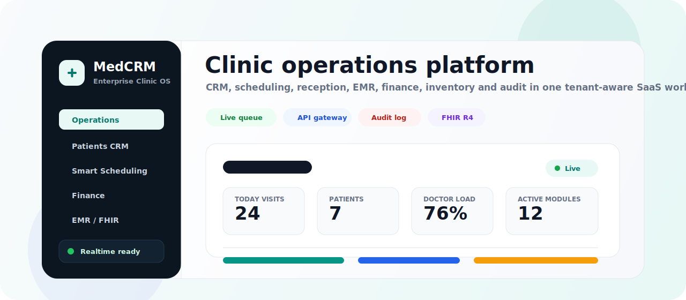

<div align="center">
  

  <h1>MedCRM</h1>
  <p><strong>Enterprise-grade SaaS CRM / MIS platform for private clinics</strong></p>
  <p><strong>Профессиональная SaaS CRM / МИС-платформа для частных клиник</strong></p>

  <p>
    <a href="#english"></a>
    <a href="#russian"></a>
  </p>

  <p>
    
    
    
    
    
    
    
    
  </p>
</div>

---

<a id="english"></a>

## English

MedCRM is a production-oriented, multi-tenant clinic operating system. It combines patient CRM, smart scheduling, live reception operations, EMR/EHR, finance, communications, inventory, integrations, analytics, RBAC, audit logging, and an API gateway into one modular SaaS foundation.

The project is intentionally built as a **modular monolith with service-ready boundaries**: fast enough for product iteration, strict enough for future extraction into independent services.

### Product Snapshot

| Area | What is implemented |
| --- | --- |
| Operations | Dashboard, live queue, room load, doctor load, operational KPIs |
| Patient CRM | Registry, duplicate search, tags, family model, notes, timeline, documents |
| Scheduling | Daily grid, week view, click-to-book, status transitions, waiting list |
| Reception | Check-in, queue priority, patient preview, invoices, cashier handoff |
| EMR/EHR | Medical record, episodes, encounters, templates, diagnoses, prescriptions, FHIR preview |
| Finance | Invoices, payments, refunds, cashier shifts, wallets, billing, payroll rules |
| Communications | Telegram/SMS-ready conversations, templates, rules, campaigns, chatbot flows |
| Inventory | Warehouses, balances, batches, FEFO-oriented data, BOM, stock alerts |
| Platform | API gateway, public/internal routing, request tracing, RBAC, audit, realtime |
| QA | E2E foundation for auth, patients, appointments, reception, scheduling conflicts |

### Demo Workspace

Seeded demo data is designed to make the product presentable immediately after running migrations and seed:

| Demo entity | Included examples |
| --- | --- |
| Tenant | `Demo Clinic`, enterprise plan, main branch |
| Users | Admin plus demo doctor accounts |
| Doctors | Radiology, dentistry, cardiology doctors with rooms and schedules |
| Patients | VIP, family, child, new, active, and debt-bearing patient records |
| Today board | Confirmed, waiting, in-progress, pending-payment, completed, cancelled visits |
| Finance | Pending and paid invoices, cashier shift, payment gateway, subscription plan |
| EMR | Medical record, active episode, draft encounter, diagnosis, prescription |
| Communications | SMS/Telegram templates, notification rule, chatbot confirmation flow |
| Inventory | Main warehouse, room warehouse, batches, low stock, service BOM |

Default credentials:

```text
tenantCode: demo-clinic
email: admin@demo.clinic
password: Admin123!
```

### Architecture

```text
MedCRM
├─ frontend/                  Next.js 16 App Router, React 19
│  ├─ app/                    Protected routes and layouts
│  ├─ modules/                Feature workspaces
│  └─ shared/                 API, permissions, realtime, UI primitives
│
├─ backend/                   NestJS modular backend
│  ├─ apps/
│  │  ├─ api-gateway/         Public/internal gateway and OpenAPI aggregation
│  │  └─ auth-service/        Domain modules hosted in service-ready boundaries
│  ├─ core/                   Audit, cache, DB, realtime, security, tenancy
│  └─ prisma/                 Schema, migrations, demo seed
│
└─ docker-compose.yml         PostgreSQL, Redis, MinIO, gateway, backend, frontend
```

### Tech Stack

| Layer | Stack |
| --- | --- |
| Frontend | Next.js 16, React 19, TypeScript, TanStack Query, Socket.IO Client, lucide-react |
| Backend | NestJS 11, TypeScript, Prisma ORM, Zod, JWT, Passport, Socket.IO |
| Data | PostgreSQL 17, Redis 7, MinIO |
| Platform | API Gateway, OpenAPI/Swagger, RBAC, audit logging, request correlation |
| Testing | Node test runner, E2E suites, scheduling conflict tests |

### Quick Start

```bash
npm install
cp .env.example .env
npm --workspace backend run prisma:generate
docker compose up -d postgres redis minio
npm --workspace backend run prisma:migrate
npm --workspace backend run prisma:seed
```

Run services locally:

```bash
npm --workspace backend run start:dev:auth
npm --workspace backend run start:dev:gateway
NEXT_PUBLIC_API_URL=http://localhost:3000 INTERNAL_API_URL=http://localhost:3000 npm --workspace frontend run dev
```

Open:

| Service | URL |
| --- | --- |
| Frontend | http://localhost:3002 |
| Public API Gateway | http://localhost:3000 |
| Internal API Gateway | http://localhost:3010 |
| Auth/domain service | http://localhost:3001 |
| MinIO console | http://localhost:9001 |

### Quality Gates

```bash
npm --workspace frontend run typecheck
npm --workspace frontend run build
npm --workspace backend run typecheck
npm --workspace backend run test:e2e
```

### API Examples

Login:

```bash
curl -X POST http://localhost:3000/auth/login \
  -H "Content-Type: application/json" \
  -d '{"tenantCode":"demo-clinic","email":"admin@demo.clinic","password":"Admin123!"}'
```

Bootstrap:

```bash
curl http://localhost:3000/auth/bootstrap \
  -H "Authorization: Bearer <access_token>"
```

Reception board:

```bash
curl http://localhost:3000/reception/dashboard \
  -H "Authorization: Bearer <access_token>"
```

### Roadmap

- Production-grade observability: OpenTelemetry, Prometheus, Grafana, tracing, alerting.
- Stronger tenant isolation: centralized Prisma scopes, DB policies, tenant-aware jobs.
- Enterprise deployment: Helm, Kubernetes, Terraform, backups, DR runbooks.
- Expanded frontend workspaces: finance, inventory, communications, analytics.
- Full QA platform: unit, integration, contract, websocket, and e2e coverage.

---

<a id="russian"></a>

## Русский

MedCRM — это production-oriented SaaS-платформа для частных клиник: CRM пациентов, умное расписание, живая регистратура, EMR/EHR, финансы, коммуникации, склад, интеграции, аналитика, RBAC, аудит и API Gateway в одной модульной системе.

Архитектурно проект построен как **модульный монолит с границами, готовыми к выделению сервисов**. Это дает скорость разработки MVP и при этом сохраняет путь к enterprise-эксплуатации.

### Что Реализовано

| Контур | Реализация |
| --- | --- |
| Операции | Операционная панель, живая очередь, загрузка кабинетов, загрузка врачей, KPI смены |
| CRM пациентов | Реестр, поиск дублей, теги, семья, заметки, timeline, юридические документы |
| Расписание | Дневная сетка, недельный вид, click-to-book, статусы, лист ожидания |
| Регистратура | Check-in, приоритет очереди, быстрый просмотр пациента, счета, передача в кассу |
| EMR/EHR | Медкарта, эпизоды, приемы, шаблоны, диагнозы, назначения, FHIR preview |
| Финансы | Счета, оплаты, возвраты, кассовые смены, кошельки, billing, payroll rules |
| Коммуникации | Telegram/SMS-ready inbox, шаблоны, правила, кампании, chatbot flows |
| Склад | Склады, остатки, партии, FEFO-данные, BOM, stock alerts |
| Платформа | API Gateway, public/internal routing, request tracing, RBAC, audit, realtime |
| Тесты | E2E для auth, patients, appointments, reception, scheduling conflicts |

### Демо-Данные

Seed заполняет проект данными так, чтобы интерфейсы сразу выглядели как рабочая клиника:

| Что есть | Примеры |
| --- | --- |
| Клиника | `Demo Clinic`, enterprise plan, основной филиал |
| Пользователи | Администратор и демо-врачи |
| Врачи | УЗИ/радиология, стоматология, кардиология, кабинеты и расписания |
| Пациенты | VIP, семья, ребенок, новый пациент, активные пациенты, пациенты с долгом |
| Today board | Подтвержден, ожидает, на приеме, к оплате, завершен, отменен |
| Финансы | Pending/paid invoices, кассовая смена, payment gateway, subscription plan |
| EMR | Медкарта, активный эпизод, черновик приема, диагноз, назначение |
| Коммуникации | SMS/Telegram шаблоны, notification rule, chatbot подтверждения |
| Склад | Центральный склад, кабинетный склад, партии, низкий остаток, BOM услуги |

Демо-доступ:

```text
Код клиники: demo-clinic
Email: admin@demo.clinic
Пароль: Admin123!
```

### Архитектура

```text
MedCRM
├─ frontend/                  Next.js 16 App Router, React 19
│  ├─ app/                    Защищенные маршруты и layout
│  ├─ modules/                Рабочие пространства модулей
│  └─ shared/                 API, permissions, realtime, UI primitives
│
├─ backend/                   NestJS modular backend
│  ├─ apps/
│  │  ├─ api-gateway/         Public/internal gateway и OpenAPI aggregation
│  │  └─ auth-service/        Доменные модули с сервисными границами
│  ├─ core/                   Audit, cache, DB, realtime, security, tenancy
│  └─ prisma/                 Schema, migrations, demo seed
│
└─ docker-compose.yml         PostgreSQL, Redis, MinIO, gateway, backend, frontend
```

### Стек

| Слой | Технологии |
| --- | --- |
| Frontend | Next.js 16, React 19, TypeScript, TanStack Query, Socket.IO Client, lucide-react |
| Backend | NestJS 11, TypeScript, Prisma ORM, Zod, JWT, Passport, Socket.IO |
| Data | PostgreSQL 17, Redis 7, MinIO |
| Platform | API Gateway, OpenAPI/Swagger, RBAC, audit logging, request correlation |
| Testing | Node test runner, E2E suites, scheduling conflict tests |

### Быстрый Старт

```bash
npm install
cp .env.example .env
npm --workspace backend run prisma:generate
docker compose up -d postgres redis minio
npm --workspace backend run prisma:migrate
npm --workspace backend run prisma:seed
```

Локальный запуск:

```bash
npm --workspace backend run start:dev:auth
npm --workspace backend run start:dev:gateway
NEXT_PUBLIC_API_URL=http://localhost:3000 INTERNAL_API_URL=http://localhost:3000 npm --workspace frontend run dev
```

Сервисы:

| Сервис | URL |
| --- | --- |
| Frontend | http://localhost:3002 |
| Public API Gateway | http://localhost:3000 |
| Internal API Gateway | http://localhost:3010 |
| Auth/domain service | http://localhost:3001 |
| MinIO console | http://localhost:9001 |

### Проверки

```bash
npm --workspace frontend run typecheck
npm --workspace frontend run build
npm --workspace backend run typecheck
npm --workspace backend run test:e2e
```

### Примеры API

Логин:

```bash
curl -X POST http://localhost:3000/auth/login \
  -H "Content-Type: application/json" \
  -d '{"tenantCode":"demo-clinic","email":"admin@demo.clinic","password":"Admin123!"}'
```

Bootstrap:

```bash
curl http://localhost:3000/auth/bootstrap \
  -H "Authorization: Bearer <access_token>"
```

Доска регистратуры:

```bash
curl http://localhost:3000/reception/dashboard \
  -H "Authorization: Bearer <access_token>"
```

### Roadmap

- Production observability: OpenTelemetry, Prometheus, Grafana, tracing, alerting.
- Tenant isolation: централизованные Prisma scopes, DB policies, tenant-aware jobs.
- Enterprise deployment: Helm, Kubernetes, Terraform, backups, DR runbooks.
- Расширение UI: финансы, склад, коммуникации, аналитика.
- Полная QA-платформа: unit, integration, contract, websocket и e2e tests.

## License

Private project. All rights reserved unless a license is added by the repository owner.
